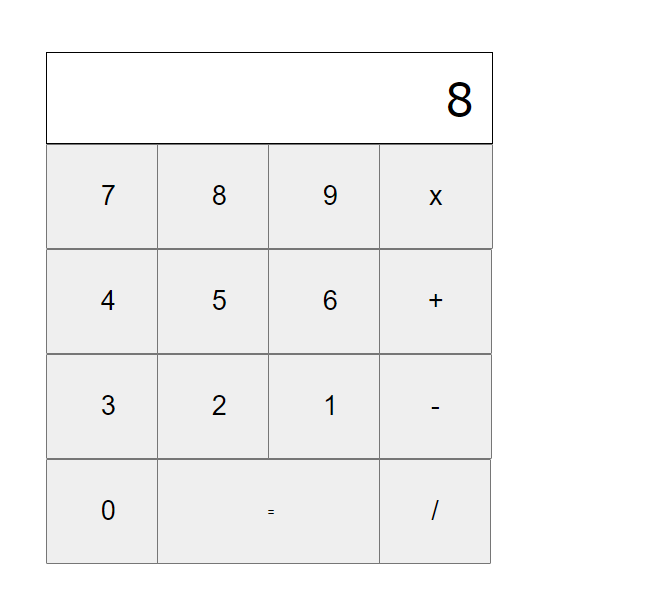

# Project Title

A simple calculator app. 

## Getting Started

These instructions will give you a copy of the project up and running on
your local machine for development and testing purposes. See deployment
for notes on deploying the project on a live system.

### Installing

# Clone this repository
$ git clone https://github.com/gaylemcclure/ecalculator-app

# Go into the repository
$ cd electron-markdownify

# Install dependencies
$ npm install

# Run the app
$ npm start

## Deployment

Add additional notes to deploy this on a live system

## Acknowledgments

